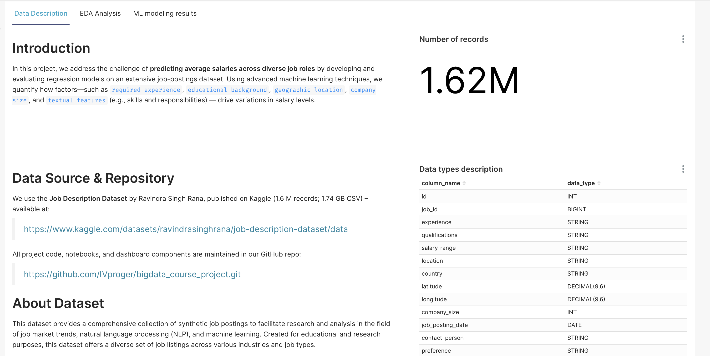
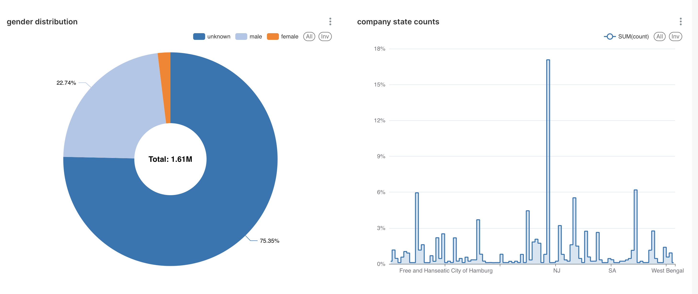
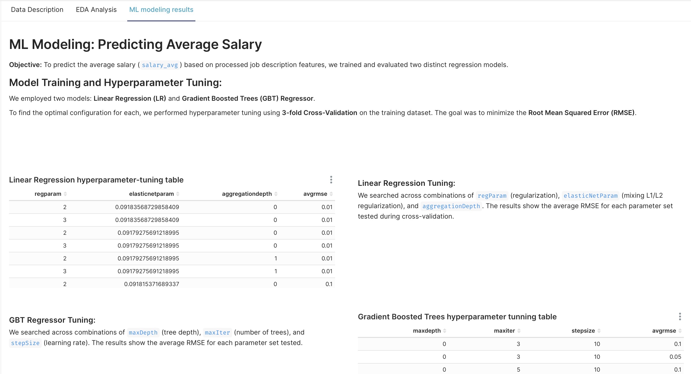

# 🏗️ Big-Data Salary Prediction project overview

End-to-end Spark / Hadoop project that ingests **Kaggle job-description data**, turns it into an **analytics-ready Hive warehouse**, runs **Spark-SQL EDA**, trains & tunes **Spark-ML regression models**, and surfaces everything in an **Apache Superset dashboard**.

High End architecture of the project

```mermaid
flowchart LR
    %% ────────────────────────────
    %% Stage I — Data Collection
    %% ────────────────────────────
    subgraph STAGE1["Stage I — Data Collection"]
        direction TB
        Kaggle["Kaggle CLI<br/>(job-descriptions.csv)"] --> PostgreSQL["PostgreSQL"]
        PostgreSQL --> Sqoop["Sqoop Import"]
        Sqoop --> HDFS1["HDFS<br/>Avro (+ schema)"]
    end

    %% ────────────────────────────
    %% Stage II — Data Warehouse & EDA
    %% ────────────────────────────
    subgraph STAGE2["Stage II — Data Warehouse &<br/>EDA"]
        direction TB
        Hive["Hive Externals<br/>(partitioned & bucketed)"] --> SparkSQL["Spark SQL<br/>(6 analyses)"]
    end

    %% ────────────────────────────
    %% Stage III — Predictive Analytics
    %% ────────────────────────────
    subgraph STAGE3["Stage III — Predictive<br/>Analytics"]
        direction TB
        Preproc["Data Preprocessing<br/>(Spark DataFrame ops)"] --> SparkML["ML Modelling<br/>(Spark ML Pipeline)"]
        SparkML --> LR["Linear Regression"]
        SparkML --> GBT["Gradient-Boosted Trees"]
    end

    %% ────────────────────────────
    %% Stage IV — Presentation & Delivery
    %% ────────────────────────────
    subgraph STAGE4["Stage IV — Presentation &<br/>Delivery"]
        direction TB
        HiveExt["Hive Externals<br/>(metrics & predictions)"] --> Superset["Apache Superset<br/>Dashboards"]
    end

    %% ────────────────────────────
    %% Cross-stage flow (left → right)
    %% ────────────────────────────
    HDFS1 --> Hive 
    SparkSQL --> Preproc
    LR --> HiveExt
    GBT --> HiveExt
```

---

## ✨ Key Features
- **One-click pipeline.** 4 bash stages or a single `main.sh`.
- **Optimised Hive layout.** Avro + partitioning (`work_type`) + bucketing (`preference`) for low scan cost.
- **Scalable ML.** Linear Regression vs. Gradient-Boosted Trees with 3-fold CV, persisted in HDFS.
- **Metrics at a glance.** KL-divergence, RMSE, R² and hyper-parameter grids ready for BI tools.
- **Dashboard ready.** External Hive tables expose CSV outputs directly to Superset.

---

## 🗂️ Repository Layout
```
├── data/            # Raw download + ML data splits (synced from HDFS)
├── docs/
│   ├── img/         # ← Put your screenshots here
│   └── report_*.md  # In-depth reports for each stage
├── models/          # Trained Spark-ML models
├── output/          # Avro schemas, EDA CSVs, predictions, evaluation logs
├── scripts/         # Bash & Python automation
├── sql/             # PostgreSQL & Hive DDL / DML
└── .venv/           # Project-scoped virtualenv
```

---

## ⚡ Quick Start

> **Prerequisites**  
> Python 3.11 • Hadoop 3 • Hive 3 • Spark 3.5 • Sqoop 1.4 • PostgreSQL 15 • Kaggle CLI

```bash
# clone & bootstrap
git clone https://github.com/IVproger/bigdata_course_project.git && cd bigdata_course_project
python -m venv .venv && source .venv/bin/activate
pip install -r requirements.txt

# store secrets
echo "POSTGRES_PASSWORD=********" > secrets/.psql.pass

# full run (≈ 30 min on 4-node cluster)
bash main.sh
```

Each stage can be invoked separately if you prefer:

```bash
bash scripts/stage1.sh   # ingest → PostgreSQL → HDFS
bash scripts/stage2.sh   # Hive warehouse + Spark-SQL EDA
bash scripts/stage3.sh   # Spark-ML training & tuning
bash scripts/stage4.sh   # metrics → Hive for BI
```

---

## 🔍 Stage Breakdown

| Stage | What happens | Key outputs |
|-------|--------------|-------------|
| **1 Data Collection** | Kaggle → PostgreSQL → Sqoop Avro in HDFS | `warehouse/*.avro` |
| **2 Warehouse & EDA** | Partitioned + bucketed Hive table, 6 Spark-SQL analyses | `output/q*_results.csv` |
| **3 Predictive ML** | Linear vs. GBT, 3-fold CV, log-salary target | `models/**`, `output/model*_predictions.csv` |
| **4 Presentation** | KL divergence, Hive externals for Superset | `output/kl_divergence.csv` |

Details live in [`docs/report_*.md`](docs/) for auditors and graders.

---

## 📊 Dashboard Preview

<p align="center">
  
</p>

<!-- Repeat for any other EDA screenshots -->
<p align="center">
  
  
</p>

---

## 🔬 Results
| Model | RMSE (log) | R² (log) | KL-Div. (salary) |
|-------|------------|----------|------------------|
| Linear Reg. | 0.273 | 0.87 | 0.052 |
| GBT | **0.201** | **0.93** | **0.039** |

→ GBT shows a 26 % RMSE reduction and better KL divergence, indicating tighter fit on the heavy-tailed salary distribution.

---

## 🤝 Contributing
Pull requests welcome! Please open an issue first to discuss major changes.

1. Fork ➜ create feature branch (`git checkout -b feat/my-feature`)  
2. Commit + push (`git commit -m "feat: add …"` → `git push origin`)  
3. Open PR → pass CI.

---

## 📄 License
Distributed under the MIT License. See [`LICENSE`](LICENSE) for details.

---

## 🙏 Acknowledgements
- **Kaggle** for the open job-descriptions dataset  
- **Apache Software Foundation** for the Hadoop ecosystem  
- University **Big-Data Engineering** course staff for project guidance

---

> _Happy crunching — and may your HDFS never fill up!_
