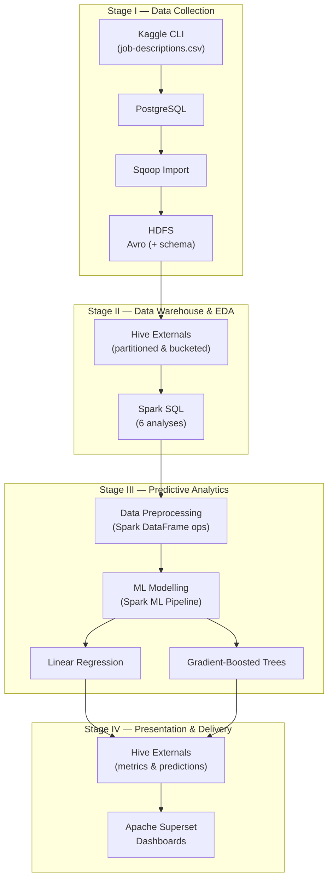

```mermaid
flowchart TB
    %% ────────────────────────────
    %% Stage I — Data Collection
    %% ────────────────────────────
    subgraph STAGE1["Stage I — Data Collection"]
        direction LR
        Kaggle["Kaggle CLI<br/>(job-descriptions.csv)"] --> PostgreSQL["PostgreSQL"]
        PostgreSQL --> Sqoop["Sqoop Import"]
        Sqoop --> HDFS1["HDFS<br/>Avro (+ schema)"]
    end

    %% ────────────────────────────
    %% Stage II — Data Warehouse & EDA
    %% ────────────────────────────
    subgraph STAGE2["Stage II — Data Warehouse & EDA"]
        direction LR
        Hive["Hive Externals<br/>(partitioned & bucketed)"] --> SparkSQL["Spark SQL<br/>(6 analyses)"]
    end

    %% ────────────────────────────
    %% Stage III — Predictive Analytics
    %% ────────────────────────────
    subgraph STAGE3["Stage III — Predictive Analytics"]
        direction TB
        Preproc["Data Preprocessing<br/>(Spark DataFrame ops)"] --> SparkML["ML Modelling<br/>(Spark ML Pipeline)"]
        SparkML --> LR["Linear Regression"]
        SparkML --> GBT["Gradient-Boosted Trees"]
    end

    %% ────────────────────────────
    %% Stage IV — Presentation & Delivery
    %% ────────────────────────────
    subgraph STAGE4["Stage IV — Presentation & Delivery"]
        direction LR
        HiveExt["Hive Externals<br/>(metrics & predictions)"] --> Superset["Apache Superset<br/>Dashboards"]
    end

    %% ────────────────────────────
    %% Cross-stage flow
    %% ────────────────────────────
    HDFS1 --> Hive            
    SparkSQL --> Preproc        
    LR --> HiveExt       
    GBT --> HiveExt

```
