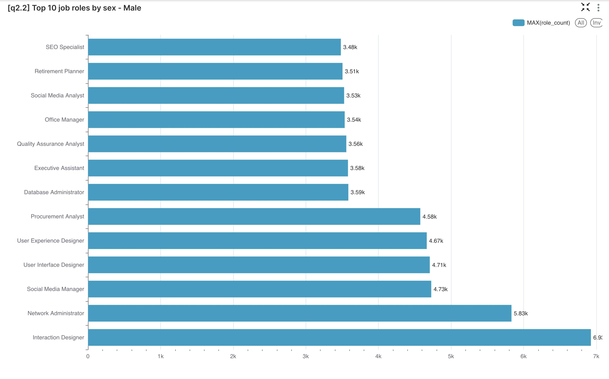

## Job Market Insights Report

### Dataset Overview

This report analyzes dataset of job postings with attributes such as role, qualifications, salary range, country, job posting date, and company size. While the data structure mirrors real-world recruitment data, the synthetic nature means that specific figures and patterns may not reflect actual market conditions. Consequently, while structural trends can be observed, exact values should be interpreted with caution.

---

### [Insight 1] Average Salary by Country

**Insight:**  
The choropleth map displays average salary levels across countries, derived from parsed salary ranges. Darker shades indicate higher average salaries. However, due to the synthetic nature of the data, these geographical distributions may not correspond to real economic trends.

**Application:**  
This visualization helps business stakeholders benchmark compensation by region, support international hiring decisions, and guide job seekers toward high-paying locations.

---

### [Insight 2.1 / Insight 2.2 / Insight 2.3] Top Job Roles by Gender

**Female-Oriented Roles:**

**Male-Oriented Roles:**

**Comparison (Male vs. Female):**

**Insight:**  
Roles like Interaction Designer and Network Administrator appear frequently across both genders. Slight variations exist, but given the synthetic data, these differences may not reflect actual workforce diversity.

**Application:**  
These visualizations assist stakeholders in understanding gender distribution across job functions, supporting diversity and inclusion initiatives in hiring and workforce development.

---

### [Insight 3] Seasonal Trends in Job Postings

**Insight:**  
The line chart indicates consistent job posting volumes over time, with minor fluctuations. These patterns likely result from the data generation process rather than actual market seasonality.

**Application:**  
This visualization aids in identifying hiring cycles, enabling recruiters to optimize job ad timing and workforce planning.

---

### [Insight 4] Job Counts by Company Category

**Insight:**  
Sectors like Technology, Management, and Data & Analytics show high job counts. The "Other" category's prominence suggests a placeholder or default classification in the synthetic data.

**Application:**  
This chart helps stakeholders understand which industries are actively hiring, informing job seekers and HR teams about sector-specific opportunities and competition.

---

### [Insight 5] Top Job Titles by Qualification

**Insight:**  
Roles such as UX/UI Designer, Software Engineer, and Digital Marketing Specialist are prevalent across qualifications like B.Tech, MBA, and B.Com. The data leans towards technical and business degrees.

**Application:**  
This visualization guides academic institutions and students toward in-demand skills and qualifications, aligning education with job market needs.

---

### [Insight 6] Seasonal Demand for Top 5 Most Requested Roles

**Insight:**  
Trend lines show cyclic demand patterns for roles like Interaction Designer and Network Administrator. These patterns likely stem from the synthetic data's structure.

**Application:**  
This chart assists in workforce planning, training programs, and forecasting demand for specific talent profiles.

---

### Final Note on Data Quality

This dataset is synthetic, meaning:
- Certain values (e.g., qualifications, gender, salary) may be over-regularized.
- Seasonal or demographic trends may not match real-world patterns.
- Insights remain structurally useful but are not predictive without real data.

In real-world applications, these insights would provide significant value to stakeholders, revealing stronger and more nuanced trends that can inform strategic decisions in recruitment, education, and workforce development.
