# Big Data Final Project Report - Team 14

## Title Page

**Project Title:** End-to-End Big Data Pipeline for Job Description Analysis and Salary Prediction  
**Team:** Team 14  
**Course:** Big Data - IU S24  
**Date:** 1/05/2025

---

## Introduction

This report details the implementation of the Big Data final project for Team 14. The project encompasses the design, development, and execution of a comprehensive data pipeline aimed at processing, analyzing, and modeling job description data obtained from Kaggle. The pipeline integrates various big data technologies to handle tasks ranging from initial data collection and storage to advanced machine learning and preparation for data visualization.

The core objective was to build a scalable and automated system demonstrating proficiency in data ingestion, warehousing, exploration, and predictive modeling within the Hadoop ecosystem. Key technologies employed include PostgreSQL, HDFS, Sqoop, Avro, Snappy, Hive, Spark (SQL, PySpark, MLlib), Bash, and Python. The pipeline culminates in preparing analytical results and model outputs for presentation, potentially via a dashboarding tool like Apache Superset.

This document outlines the business objectives, describes the dataset and data characteristics, details the pipeline architecture and implementation across its four stages, presents the results of data analysis and machine learning, and concludes with reflections and recommendations.

---

## Business Objectives

The primary business objectives driving this project were:

1.  **Understand Job Market Trends:** Analyze job posting data to identify patterns related to salary, required qualifications, popular roles, geographic distribution, and temporal trends.
2.  **Predict Job Salaries:** Develop machine learning models to predict the average salary for a job posting based on its characteristics (e.g., title, required skills, experience, location).
3.  **Develop a Scalable Data Processing Framework:** Implement an automated pipeline capable of handling potentially large volumes of job data, demonstrating best practices in data storage, processing, and analysis using big data tools.
4.  **Provide Actionable Insights:** Prepare the findings from EDA and ML modeling in a format suitable for presentation and potential use in business decision-making (e.g., recruitment strategy, salary benchmarking).

---

## 2. Dataset Description

[Link to the Superset](http://hadoop-03.uni.innopolis.ru:8808/superset/dashboard/97/)

In this project, we address the challenge of predicting average salaries across diverse job roles by developing and evaluating regression models on an extensive job-postings dataset. Using advanced machine learning techniques, we quantify how factors—such as required experience, educational background, geographic location, company size, and textual features (e.g., skills and responsibilities) — drive variations in salary levels.

**Data Source & Repository:**
We use the Job Description Dataset by Ravindra Singh Rana, published on Kaggle (1.6M records; 1.74 GB CSV) – available at:
[https://www.kaggle.com/datasets/ravindrasinghrana/job-description-dataset/data](https://www.kaggle.com/datasets/ravindrasinghrana/job-description-dataset/data)

All project code, notebooks, and dashboard components are maintained in our GitHub repo:
[https://github.com/IVproger/bigdata_course_project.git](https://github.com/IVproger/bigdata_course_project.git)

**About Dataset:**
The project utilizes the "Job Description Dataset" sourced from Kaggle (`ravindrasinghrana/job-description-dataset`). This dataset is a comprehensive collection of **synthetic job postings**, created specifically for facilitating research and analysis in areas such as job market trends, Natural Language Processing (NLP), and Machine Learning model development within an educational context.

It offers a diverse set of job listings across various industries and job types. The columns included in the dataset are:

*   **Job Id:** A unique identifier for each job posting.
*   **Experience:** The required or preferred years of experience.
*   **Qualifications:** The educational qualifications needed.
*   **Salary Range:** The range of salaries or compensation offered.
*   **Location:** The city or area where the job is located.
*   **Country:** The country where the job is located.
*   **Latitude:** The latitude coordinate of the job location.
*   **Longitude:** The longitude coordinate of the job location.
*   **Work Type:** The type of employment (e.g., Full-time, Part-time, Contract).
*   **Company Size:** The approximate size or scale of the hiring company.
*   **Job Posting Date:** The date when the job posting was made public.
*   **Preference:** Special preferences or requirements for applicants (e.g., "Only Male", "Only Female", "Both").
*   **Contact Person:** The name of the contact person or recruiter.
*   **Contact:** Contact information for job inquiries.
*   **Job Title:** The job title or position being advertised.
*   **Role:** The role or category of the job (e.g., Software Developer, Marketing Manager).
*   **Job Portal:** The platform or website where the job was posted.
*   **Job Description:** A detailed description of the job responsibilities and requirements.
*   **Benefits:** Information about benefits offered (e.g., health insurance, retirement plans).
*   **Skills:** The skills or qualifications required.
*   **Responsibilities:** Specific responsibilities and duties associated with the job.
*   **Company Name:** The name of the hiring company.
*   **Company Profile:** A brief overview of the company's background and mission.

## Data Characteristics

**Number of Records:** 1.62 Million

**Data Types (as defined in Hive/PostgreSQL):**

| column_name       | data_type    |
| :---------------- | :----------- |
| id                | INT          |
| job_id            | BIGINT       |
| experience        | STRING       |
| qualifications    | STRING       |
| salary_range      | STRING       |
| location          | STRING       |
| country           | STRING       |
| latitude          | DECIMAL(9,6) |
| longitude         | DECIMAL(9,6) |
| company_size      | INT          |
| job_posting_date  | DATE         |
| contact_person    | STRING       |
| preference        | STRING       |
| contact           | STRING       |
| job_title         | STRING       |
| role              | STRING       |
| job_portal        | STRING       |
| job_description   | STRING       |
| benefits          | STRING       |
| skills            | STRING       |
| responsibilities  | STRING       |
| company_name      | STRING       |
| company_profile   | STRING       |
| work_type         | STRING       |

---

## Architecture of Data Pipeline

The project follows a staged batch processing architecture, leveraging various components of the Hadoop ecosystem and related technologies. The diagram below illustrates the flow:

*   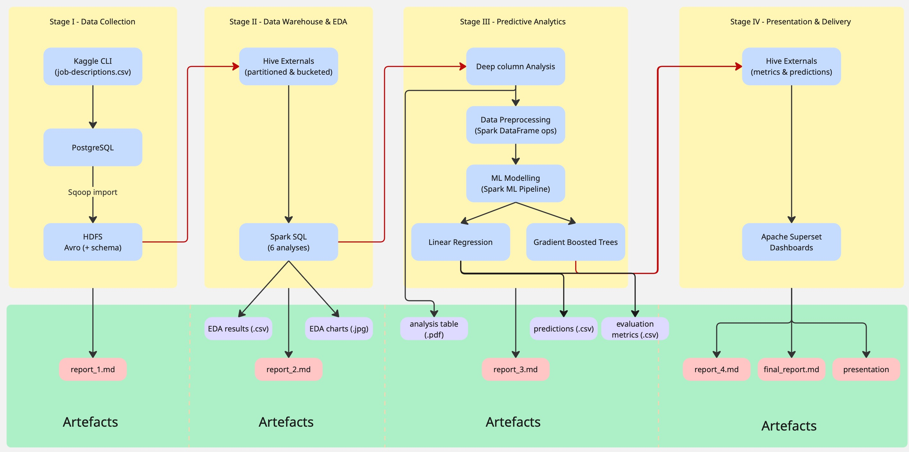

**Workflow Summary:**
1.  **Data Acquisition:** Job data is downloaded from Kaggle via its API (`scripts/data_collection.sh`) into a local CSV file.
2.  **Relational Staging:** The CSV data is loaded into a PostgreSQL database (`scripts/build_projectdb.py`) for initial structuring and validation.
3.  **HDFS Ingestion:** Sqoop imports the data from PostgreSQL into HDFS as compressed Avro files (`scripts/stage1.sh`).
4.  **Data Warehousing:** An optimized external Hive table (partitioned and bucketed) is created over the HDFS Avro data (`scripts/create_hive_tables.sh`).
5.  **EDA:** Spark SQL executes HiveQL queries against the Hive table. Results are stored back into PostgreSQL and also exported as local CSV files (`scripts/run_hive_queries.py`).
6.  **ML Preprocessing:** A Spark job reads data (likely from Hive), performs feature engineering and log-transforms the target variable, saving train/test splits as JSON to HDFS (`scripts/data_preprocessing.py`).
7.  **ML Modeling:** Another Spark job loads the preprocessed data from HDFS, trains/tunes models (Linear Regression, GBT), evaluates them, and saves models, predictions (inverse-transformed to original scale), and evaluation metrics to HDFS (`scripts/ml_modeling.py`). Results are downloaded locally.
8.  **Presentation Preparation:** A Spark job calculates KL divergence on the original-scale predictions from HDFS. Hive external tables are created over the HDFS prediction/evaluation/KL CSV files to make them accessible for BI tools (`scripts/stage4.sh`). KL results are downloaded locally.
9.  **Visualization (Manual):** Apache Superset connects to PostgreSQL (for EDA results) and Hive (for ML results via the external tables) to build interactive dashboards.

Automation scripts (`scripts/stage*.sh`) orchestrate the transitions between these stages.

---

## The Input and The Output for Each Stage

**Stage 1: Data Collection and Storage**
*   **Input:** Kaggle API dataset identifier (`ravindrasinghrana/job-description-dataset`), PostgreSQL credentials (`secrets/.psql.pass`).
*   **Output:**
    *   Local raw data CSV: `data/job_descriptions.csv`
    *   Populated PostgreSQL table: `team14_projectdb.job_descriptions`
    *   HDFS data: Snappy-compressed Avro files in `project/warehouse/job_descriptions/`
    *   Local metadata: `output/job_descriptions.avsc`, `output/job_descriptions.java`
    *   HDFS metadata: `project/warehouse/avsc/job_descriptions.avsc`

**Stage 2: Hive Data Warehousing & EDA**
*   **Input:** HDFS Avro data (`project/warehouse/job_descriptions/`), HDFS Avro schema (`project/warehouse/avsc/job_descriptions.avsc`), HiveQL EDA queries (`sql/q*.hql`), PostgreSQL credentials (`secrets/.psql.pass`).
*   **Output:**
    *   Hive table: `team14_projectdb.job_descriptions_part` (external, partitioned, bucketed)
    *   EDA results in PostgreSQL: `team14_projectdb.q*_results` tables
    *   EDA results as local CSV: `output/q*.csv`
    *   Hive script log: `output/hive_results.txt`
    *   (Manual) Visualization charts: `output/q*.jpg`/`png`

**Stage 3: Predictive Data Analytics**
*   **Input:** Data from Hive table `team14_projectdb.job_descriptions_part` (or potentially HDFS Avro data directly, depending on `scripts/data_preprocessing.py` logic).
*   **Output:**
    *   Preprocessed data in HDFS: JSON files in `project/data/train/`, `project/data/test/`
    *   Preprocessed data locally: `data/train.json`, `data/test.json`
    *   Trained models in HDFS: `project/models/model1/`, `project/models/model2/`
    *   Trained models locally: `models/model1/`, `models/model2/`
    *   Predictions/Evaluation in HDFS: CSV files in `project/output/` (e.g., `model*_predictions.csv`, `evaluation.csv`, `*_tuning_results.csv`)
    *   Predictions/Evaluation locally: CSV files in `output/`

**Stage 4: Presentation Preparation**
*   **Input:** Prediction/Evaluation CSVs from HDFS (`project/output/model*_predictions.csv`, `project/output/evaluation.csv`).
*   **Output:**
    *   KL Divergence results in HDFS: `project/output/kl_divergence.csv`
    *   KL Divergence results locally: `output/kl_divergence.csv`
    *   Hive external tables for results: `evaluation_results`, `model1_predictions`, `model2_predictions`, `kl_divergence`
    *   Hive script log: `output/stage4_hive_results.txt`

---

## Data Preparation

Data preparation occurred primarily in two phases: initial loading/structuring in Stage 1 and feature engineering/preprocessing in Stage 3.

### ER Diagram

The primary relational structure was defined in Stage 1 within PostgreSQL.

*   **Table:** `job_descriptions`
    *   **Columns:** (Includes fields like `id` (PK), `job_id` (unique), `experience`, `qualifications`, `salary_range`, `location`, `country`, `latitude`, `longitude`, `work_type`, `company_size`, `job_posting_date`, `preference`, `contact_person`, `contact`, `job_title`, `role`, `job_portal`, `job_description`, `benefits`, `skills`, `responsibilities`, `company_name`, `company_profile`)
    *   **Relationships:** This project uses a single primary table for the job postings. No explicit relationships to other tables.
    *   **Constraints:** Includes primary key (`id`), data type definitions, and check constraints (e.g., latitude/longitude ranges, positive company size, job posting date not in the future).

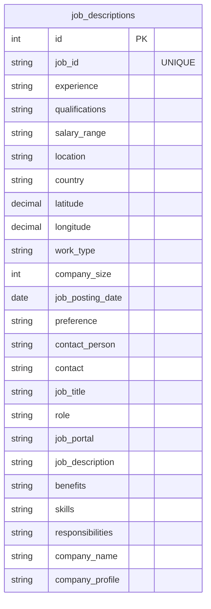

### Some Samples from the Database

| id  | job_id         | experience     | job_posting_date | qualifications | salary_range | location   | country      | latitude | longitude | work_type | company_size | contact_person   | contact                 | job_title                    | role                     | job_portal   | job_description                                                                                                                                                              | benefits                                                                                                                     | skills                                                                                                                                 | responsibilities                                                                                                                                   | company_name                      | company_profile                                                                                                                             |
| :-: | :------------- | :------------- | :--------------- | :------------- | :----------- | :--------- | :----------- | :------- | :-------- | :-------- | :----------- | :--------------- | :---------------------- | :--------------------------- | :----------------------- | :----------- | :--------------------------------------------------------------------------------------------------------------------------------------------------------------------------- | :--------------------------------------------------------------------------------------------------------------------------- | :--------------------------------------------------------------------------------------------------------------------------------------------- | :----------------------------------------------------------------------------------------------------------------------------------------- | :-------------------------------- | :------------------------------------------------------------------------------------------------------------------------------------------ |
| 1   | 1089843540111562 | 5 to 15 Years  | 2022-04-24       | M.Tech         | $59K-$99K    | Douglas    | Isle of Man  | 54.2361  | -4.5481   | Intern    | 26801        | Brandon Cunningham | 001-381-930-7517x737    | Digital Marketing Specialist | Social Media Manager     | Snagajob     | Social Media Managers oversee an organizations social media presence. They create and schedule content, engage with followers, and analyze social media metrics to drive brand awareness and engagement. | {'Flexible Spending Accounts (FSAs), Relocation Assistance, Legal Assistance, Employee Recognition Programs, Financial Counseling'} | Social media platforms (e.g., Facebook, Twitter, Instagram) Content creation and scheduling Social media analytics and insights Community engagement Paid social advertising | Manage and grow social media accounts, create engaging content, and interact with the online community. Develop social media content calendars and strategies. Monitor social media trends and engagement metrics. | Icahn Enterprises                 | {"Sector":"Diversified","Industry":"Diversified Financials","City":"Sunny Isles Beach","State":"Florida","Zip":"33160","Website":"www.ielp.com","Ticker":"IEP","CEO":"David Willetts"} |
| 2   | 398454096642776  | 2 to 12 Years  | 2022-12-19       | BCA            | $56K-$116K   | Ashgabat   | Turkmenistan | 38.9697  | 59.5563   | Intern    | 100340       | Francisco Larsen   | 461-509-4216            | Web Developer                | Frontend Web Developer   | Idealist     | Frontend Web Developers design and implement user interfaces for websites, ensuring they are visually appealing and user-friendly. They collaborate with designers and backend developers to create seamless web experiences for users. | {'Health Insurance, Retirement Plans, Paid Time Off (PTO), Flexible Work Arrangements, Employee Assistance Programs (EAP)'} | HTML, CSS, JavaScript Frontend frameworks (e.g., React, Angular) User experience (UX)                                                        | Design and code user interfaces for websites, ensuring a seamless and visually appealing user experience. Collaborate with UX designers to optimize user journeys. Ensure cross-browser compatibility and responsive design. | PNC Financial Services Group      | {"Sector":"Financial Services","Industry":"Commercial Banks","City":"Pittsburgh","State":"Pennsylvania","Zip":"15222","Website":"www.pnc.com","Ticker":"PNC","CEO":"William S. Demchak"} |
| 3   | 481640072963533  | 0 to 12 Years  | 2022-09-14       | PhD            | $61K-$104K   | Macao      | Macao SAR, China | 22.1987  | 113.5439  | Temporary | 84525        | Gary Gibson      | 9687619505              | Operations Manager           | Quality Control Manager  | Jobs2Careers | Quality Control Managers establish and enforce quality standards within an organization. They develop quality control processes, perform inspections, and implement corrective actions to maintain product or service quality. | {'Legal Assistance, Bonuses and Incentive Programs, Wellness Programs, Employee Discounts, Retirement Plans'}              | Quality control processes and methodologies Statistical process control (SPC) Root cause analysis and corrective action Quality management systems (e.g., ISO 9001) Compliance and regulatory knowledge | Establish and enforce quality control standards and procedures. Conduct quality audits and inspections. Collaborate with production teams to address quality issues and implement improvements.      | United Services Automobile Assn.  | {"Sector":"Insurance","Industry":"Insurance: Property and Casualty (Stock)","City":"San Antonio","State":"Texas","Zip":"78288","Website":"www.usaa.com","Ticker":"","CEO":"Wayne Peacock"}  |

This rich, albeit synthetic, dataset serves as the input for all subsequent processing and analysis stages in the project. Its structure allows for exploration into various potential use cases, such as building predictive models for job market trends, enhancing job recommendation systems, developing NLP models for resume parsing, analyzing regional job market disparities, and exploring salary prediction models.

*(Acknowledgements from the dataset creators: Python Faker library for dataset generation and ChatGPT for fine-tuning and quality assurance.)*

### Creating Hive Tables and Preparing the Data for Analysis

As detailed in Stage 2, the data ingested into HDFS (Avro format) was structured for efficient analytical querying using Hive:

1.  **Hive Database:** `team14_projectdb` created, located at `project/hive/warehouse`.
2.  **External Table:** The main analysis table `job_descriptions_part` was created as an EXTERNAL table, meaning Hive manages the metadata, but the data resides in the specified HDFS location (`project/hive/warehouse/job_descriptions_part`). Dropping the table does not delete the underlying data.
3.  **Storage Format:** AVRO was used, consistent with the Sqoop import, leveraging Snappy compression.
4.  **Partitioning:** The table was partitioned by `work_type`. This creates separate subdirectories within HDFS for each distinct work type (e.g., Full-time, Part-time). Queries filtering by `work_type` can benefit significantly by only scanning the relevant partitions (subdirectories). Dynamic partitioning (`hive.exec.dynamic.partition.mode=nonstrict`) was enabled during the `INSERT` operation to automatically create partitions based on the data.
5.  **Bucketing:** Within each partition, the data was bucketed by `preference` into 3 buckets. Bucketing physically splits the data within a partition into a fixed number of files based on the hash of the bucketing column (`preference`). This can improve performance for queries involving joins or aggregations on the bucketing column and enables more efficient sampling. `hive.enforce.bucketing = true` was set to ensure data was correctly bucketed during the insert.
6.  **Data Loading:** An `INSERT INTO ... SELECT ...` statement loaded data from the initial temporary table (pointing to Sqoop output) into the final partitioned/bucketed table, performing necessary type conversions (e.g., timestamp to DATE).

This optimized Hive table structure formed the basis for the EDA performed in Stage 2 and potentially the input for ML preprocessing in Stage 3.

---

## Data Analysis

[Link to the Superset](http://hadoop-03.uni.innopolis.ru:8808/superset/dashboard/97/)

Exploratory Data Analysis (EDA) was performed in Stage 2 using Spark SQL executing HiveQL queries against the optimized `job_descriptions_part` Hive table.

Firstly, general EDA analysis has been conducted by running `scripts/feature_analysis.sh` and the following results has been received:

### General EDA Charts

*   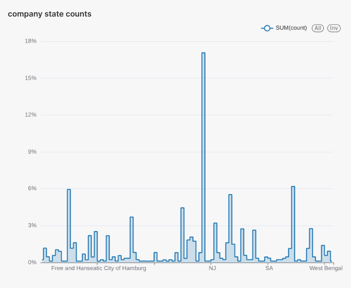
*   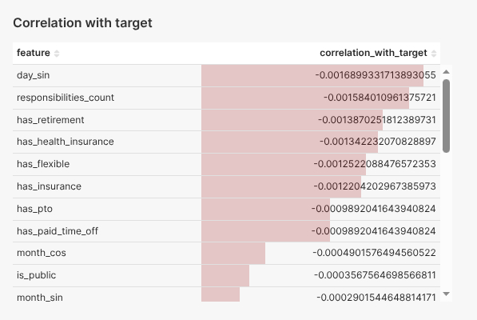
*   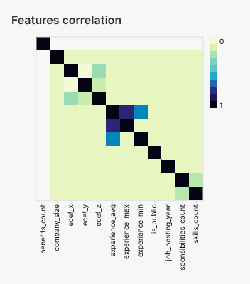
*   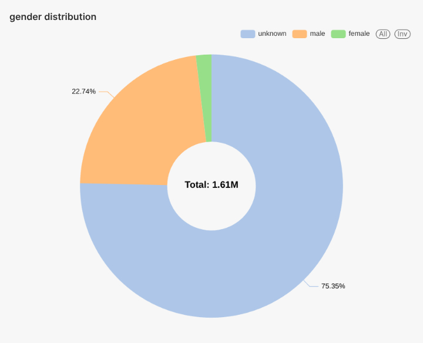
*   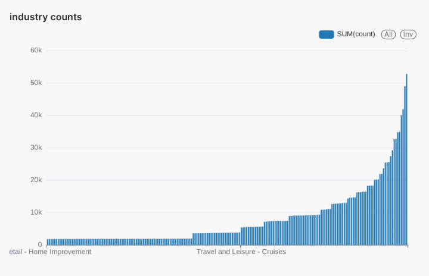
*   
*   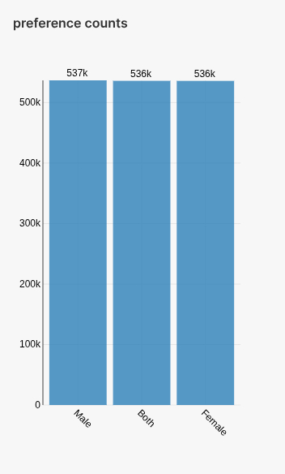
*   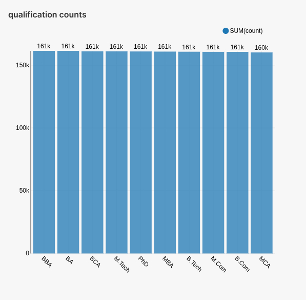
*   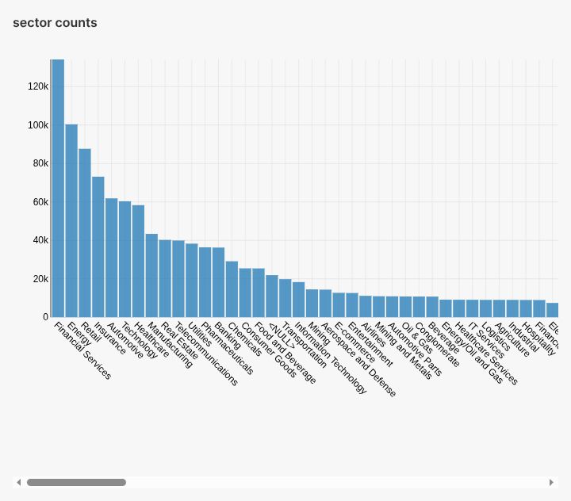
*   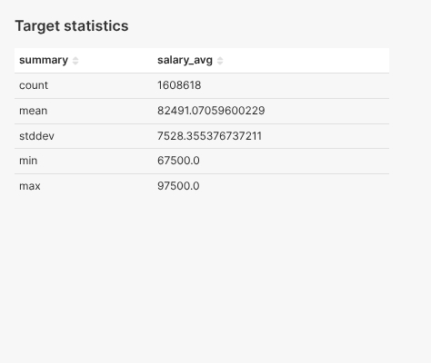
*   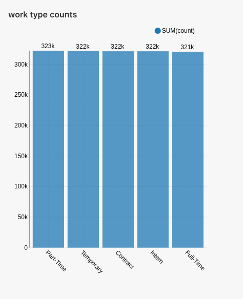

**Insight:**  

Overall, the cleaned dataset of 1,608,618 job postings presents a solid foundation for downstream modeling but exhibits a few limitations that temper its quality. On the positive side:

- **Size & Coverage (9/10):** With over 1.6 million records spanning multiple years, sectors, geographies, and portals, the dataset is sufficiently large and diverse to capture broad labor-market dynamics.
- **Target Distribution (8/10):** The average annual salary sits at \$82,491 (±\$7,528), with a reasonable spread (min \$67,500; max \$97,500). There are no extreme outliers, suggesting good reliability in the target variable.
- **Categorical Depth (7/10):** Key categorical fields (qualifications, work type, sector, industry, state) each have dozens of levels. However, many rare categories will require grouping or encoding to avoid noise.

On the flip side:

- **Weak Linear Signals (4/10):** No numerical or binary feature shows a correlation above |0.002| with salary_avg. Even cyclical/time features and company size barely move the needle, implying that simple linear models will struggle.
- **Multicollinearity (6/10):** Experience_max and experience_avg are highly correlated (ρ = 0.802), indicating redundancy. Other numerical features are largely orthogonal, which is positive.
- **Missing & "Unknown" Flags (5/10):** Several "has_*" benefit flags returned NaN correlations (e.g., benefits_count, has_dental), pointing to missing or improperly encoded values. "unknown" accounts for 75% of CEO gender, limiting interpretability.

**Overall Data Quality Score: 6.5 / 10**

This reflects a robust sample size and well-distributed salary target, tempered by weak direct predictors and the need for careful imputation, encoding, and feature engineering. 

### Specific Data Insights

The results of the six EDA queries (`sql/q1.hql` - `sql/q6.hql`) were:
1.  Stored in corresponding PostgreSQL tables: `team14_projectdb.q1_results` through `q6_results`.
2.  Exported as local CSV files: `output/q1.csv` through `output/q6.csv`.

These tables/files contain the aggregated data answering the specific analytical questions posed by each query.

*(Refer to the `output/q*.csv` files or query the `q*_results` tables in PostgreSQL for the specific numerical results).*

### Insights Charts

Visualizations for the EDA results were generated manually using Apache Superset, connecting to the PostgreSQL `q*_results` tables. These charts are saved as image files:

*   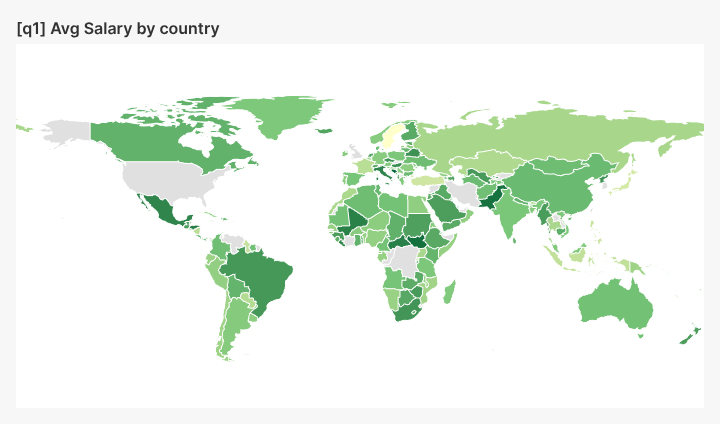
**Insight:**  
The choropleth map displays average salary levels across countries, derived from parsed salary ranges. Darker shades indicate higher average salaries. However, due to the synthetic nature of the data, these geographical distributions may not correspond to real economic trends.

**Application:**  
This visualization helps business stakeholders benchmark compensation by region, support international hiring decisions, and guide job seekers toward high-paying locations.

*   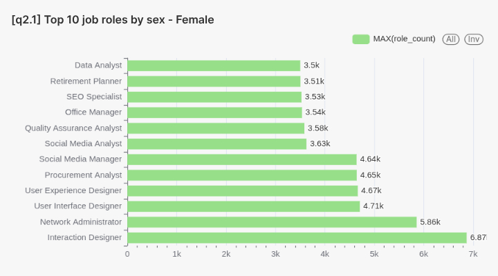
*   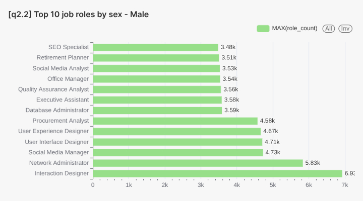
*   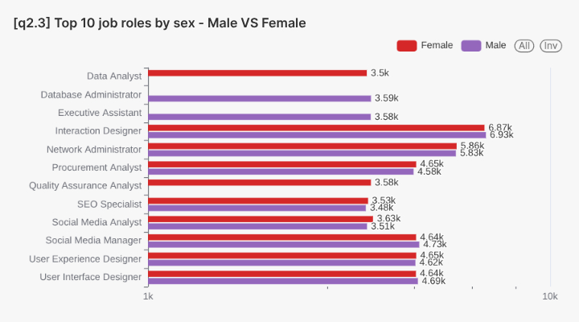

**Insight:**  
Roles like Interaction Designer and Network Administrator appear frequently across both genders. Slight variations exist, but given the synthetic data, these differences may not reflect actual workforce diversity.

**Application:**  
These visualizations assist stakeholders in understanding gender distribution across job functions, supporting diversity and inclusion initiatives in hiring and workforce development.

*   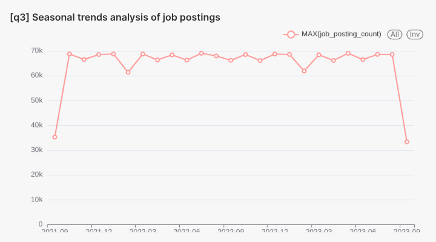

**Insight:**  
The line chart indicates consistent job posting volumes over time, with minor fluctuations. These patterns likely result from the data generation process rather than actual market seasonality.

**Application:**  
This visualization aids in identifying hiring cycles, enabling recruiters to optimize job ad timing and workforce planning.

*   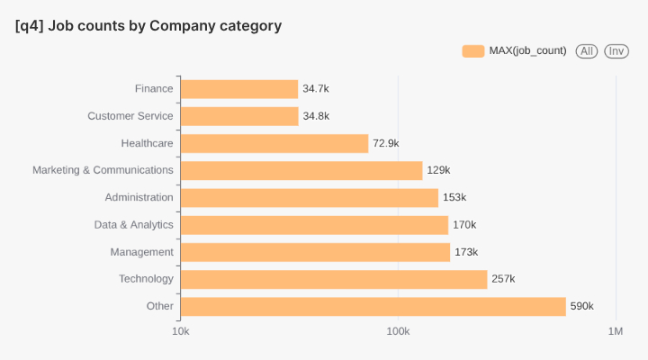

**Insight:**  
Sectors like Technology, Management, and Data & Analytics show high job counts. The "Other" category's prominence suggests a placeholder or default classification in the synthetic data.

**Application:**  
This chart helps stakeholders understand which industries are actively hiring, informing job seekers and HR teams about sector-specific opportunities and competition.

*   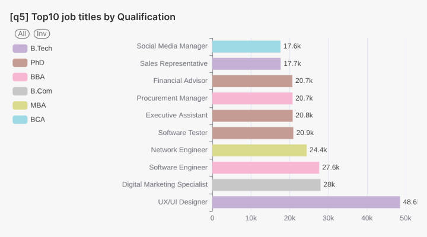

**Insight:**  
Roles such as UX/UI Designer, Software Engineer, and Digital Marketing Specialist are prevalent across qualifications like B.Tech, MBA, and B.Com. The data leans towards technical and business degrees.

**Application:**  
This visualization guides academic institutions and students toward in-demand skills and qualifications, aligning education with job market needs.

*   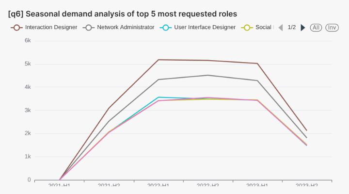

**Insight:**  
Trend lines show cyclic demand patterns for roles like Interaction Designer and Network Administrator. These patterns likely stem from the synthetic data's structure.

**Application:**  
This chart assists in workforce planning, training programs, and forecasting demand for specific talent profiles.

---

## 7. ML Modeling

Predictive modeling was performed in Stage 3 to predict average job salaries (`salary_avg`) using Spark ML.

### 7.1. Feature Extraction and Data Preprocessing

This crucial step, implemented in `scripts/data_predprocessing.py`, transformed the raw data (read from the `team14_projectdb.job_descriptions_part` Hive table) into a format suitable for machine learning algorithms.

1.  **Initial Cleaning:** Rows with null values in essential columns were dropped (`na.drop()`).
2.  **Salary Parsing:** The `salary_range` string (e.g., "$59K-$99K") was parsed using a UDF (`extract_salary_range`) to extract numerical minimum (`salary_min`) and maximum (`salary_max`) values. An average salary (`salary_avg`) was calculated as `(salary_min + salary_max) / 2`. Rows where parsing failed were filtered out.
3.  **Experience Parsing:** Similarly, the `experience` string (e.g., "5 to 15 Years") was parsed using `extract_experience` UDF to get `experience_min`, `experience_max`, and calculate `experience_avg`.
4.  **JSON Parsing (`company_profile`):** The `company_profile` column, containing JSON strings, was validated and parsed using `from_json` to extract structured fields like `Sector`, `Industry`, `City`, `State`, `Zip`, `Website`, `Ticker`, and `CEO`.
5.  **Derived Features:**
    *   `is_public`: A binary flag created based on the presence of a non-empty `Ticker` symbol.
    *   `ceo_gender`: Inferred ('male', 'female', 'unknown') from the `CEO`'s first name using the `infer_gender` UDF with predefined name lists.
6.  **Benefits Processing:** The `benefits` string was cleaned (removing braces, quotes), and `benefits_count` was calculated. Binary flags (`has_health_insurance`, `has_dental`, etc.) were created for common benefit types based on string matching.
7.  **Text Feature Counts:** Simple counts were derived: `skills_count` (based on space separation) and `responsibilities_count` (based on period separation).
8.  **Date Processing:** The `job_posting_date` (Date type) was decomposed into `job_posting_year`, `job_posting_month`, and `job_posting_day`. Cyclical features (`month_sin`, `month_cos`, `day_sin`, `day_cos`) were generated using sine and cosine transformations to capture seasonality.
9.  **Geospatial Processing (ECEF):** Latitude and longitude were converted into Earth-Centered, Earth-Fixed (ECEF) coordinates (`ecef_x`, `ecef_y`, `ecef_z`) using the `lat_lon_to_ecef` UDF. This represents the 3D Cartesian coordinates, potentially capturing spatial relationships better than raw lat/lon for some models.
10. **Feature Selection:** Based on the processing, features were categorized:
    *   `numerical_features`: e.g., `company_size`, `benefits_count`, `skills_count`, `responsibilities_count`, `job_posting_year`, `experience_min`, `experience_max`, `experience_avg`, `ecef_x`, `ecef_y`, `ecef_z`, `is_public`.
    *   `categorical_features`: e.g., `qualifications`, `work_type`, `preference`, `job_portal`, `sector`, `industry`, `company_state`, `ceo_gender`.
    *   `text_features`: `job_title`, `role`, `job_description`.
    *   `cyclical_features`: `month_sin`, `month_cos`, `day_sin`, `day_cos`.
    *   `binary_features`: `has_*` benefit flags.
11. **ML Pipeline Construction:** A Spark ML `Pipeline` was constructed to apply transformations consistently:
    *   **Categorical:** `StringIndexer` (convert strings to indices) -> `OneHotEncoder` (convert indices to sparse binary vectors).
    *   **Text:** `Tokenizer` (split into words) -> `StopWordsRemover` (remove common words) -> `CountVectorizer` (create term frequency vectors, `minDF=5.0`) -> `IDF` (calculate Inverse Document Frequency vectors).
    *   **Numerical:** `VectorAssembler` (group numerical features) -> `StandardScaler` (scale numerical features to have zero mean and unit variance).
    *   **Final Assembly:** A `VectorAssembler` combined the scaled numerical features, cyclical features, encoded categorical features, TF-IDF text features, and binary features into a single `features` vector.
12. **Pipeline Application:** The defined pipeline was fitted to the data (`pipeline.fit()`), and then used to transform the dataset (`pipeline_model.transform()`).
13. **Target Variable Transformation:** Crucially, the target variable `salary_avg` (renamed to `label`) was transformed using `log1p` (natural log of 1 + value). This addresses the common right-skewness of salary data and stabilizes variance, which is often beneficial for regression models.
14. **Data Splitting & Saving:** The final preprocessed data (containing the `features` vector and the log-transformed `label`) was split into training (70%) and testing (30%) sets using a random split (`seed=42`). These datasets were saved as JSON files to HDFS (`project/data/train`, `project/data/test`).

### 7.2. Training and Fine-tuning

Model training and optimization were performed by the `scripts/ml_modeling.py` script.

1.  **Data Loading:** The preprocessed training and testing data were loaded from the HDFS JSON files (`project/data/train`, `project/data/test`). An explicit schema (`StructType` with `VectorUDT` for features and `DoubleType` for label) was provided during loading to ensure correctness and prevent schema inference issues. The data was cached (`cache()`) for efficiency.
2.  **Models Selected:** Two regression algorithms were chosen:
    *   **Linear Regression (`LinearRegression`):** A standard, interpretable linear model.
    *   **Gradient-Boosted Tree Regressor (`GBTRegressor`):** An ensemble tree-based model capable of capturing non-linearities.
3.  **Hyperparameter Tuning Strategy:** Cross-validation was used to find the best hyperparameters for each model type:
    *   **Parameter Grids (`ParamGridBuilder`):** Specific hyperparameters and ranges were defined:
        *   Linear Regression: `regParam` ([0.01, 0.1, 0.5]), `elasticNetParam` ([0.0, 0.5, 1.0]), `aggregationDepth` ([2, 3]).
        *   GBT Regressor: `maxDepth` ([3, 5]), `maxIter` ([10]), `stepSize` ([0.1, 0.05]).
    *   **Cross-Validation (`CrossValidator`):** Configured with:
        *   `numFolds=3`: The training data was split into 3 folds for training and validation.
        *   `evaluator`: `RegressionEvaluator` using **RMSE** (Root Mean Squared Error) on the **log-transformed scale** as the metric to optimize.
        *   `parallelism=4`: Allowed up to 4 parameter combinations to be trained/evaluated in parallel.
        *   `seed=42`: For reproducibility.
4.  **Model Training:** The `CrossValidator` was fitted (`fit()`) to the training data for each model type (LR and GBT). This process iterated through the parameter grid, training and evaluating models for each combination using the 3-fold split.
5.  **Best Model Selection:** The `CrossValidator` automatically selected the hyperparameter combination that resulted in the lowest average RMSE across the folds. The `.bestModel` attribute provided the final, tuned model (`model1` for LR, `model2` for GBT).
6.  **Saving Models & Tuning Results:**
    *   The best trained `model1` and `model2` were saved to HDFS (`project/models/model1`, `project/models/model2`).
    *   Detailed tuning results (parameter combinations and their average RMSE) were saved as CSV files to HDFS (`project/output/lr_tuning_results.csv`, `project/output/gbt_tuning_results.csv`).

### 7.3. Evaluation

The best model identified via cross-validation for both LR and GBT was then evaluated on a held-out **test dataset**

*   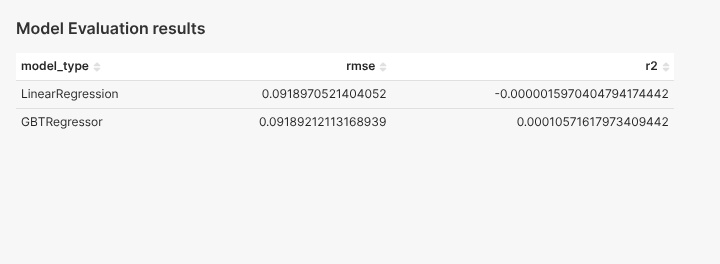

- Both models achieve a similar, very low RMSE (around 0.0919), suggesting the target variable was likely scaled or normalized during preprocessing.
- The **R-squared (R2)** values are extremely low (close to 0 for GBT and slightly negative for LR). This indicates that neither model, despite tuning, explains a significant portion of the variance in average salary using the current features.
-  Based purely on R2 on the test set, the GBT model (`R2 ≈ 0.0001`) shows a marginally better fit than the LR model.

### **Prediction Distribution Comparison (KL Divergence):**

To assess how well the *distribution* of each model's predictions matches the distribution of the *actual* salaries in the test set, we calculated the **Kullback-Leibler (KL) Divergence**. Lower KL divergence values indicate that the predicted distribution is more similar to the actual distribution.

*   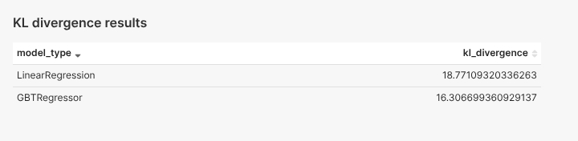

- The GBT Regressor (KL ≈ 16.31) has a lower KL divergence than the Linear Regression model (KL ≈ 18.77).
- This suggests the GBT model's predictions, as a whole distribution, are closer to the actual salary distribution compared to the LR model's predictions.

### **Actual vs. Predicted Salaries:**

The following tables visualize the relationship between the actual average salaries and the salaries predicted by each model on the test data.

*   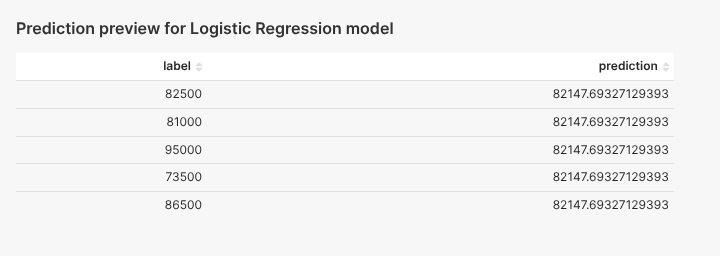
*   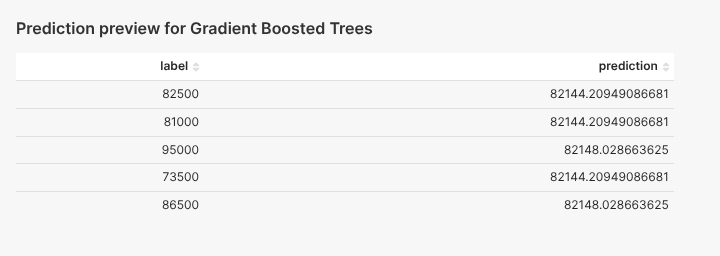

### **ML Modeling Summary:**

*Linear Regression* and *GBT models* were successfully trained and tuned using 3-fold cross-validation. While the *GBT model* demonstrates slightly better performance based on **R2** and **KL Divergence** on the test set, the overall predictive power of both models is limited, as indicated by the near-zero **R2** values. This suggests that the selected features, even after preprocessing, may not be sufficient to accurately capture the nuances driving average salary variations in this dataset. Further feature engineering or exploring more complex models could be potential next steps.

---

## 8. Data Presentation

[Link to the Superset Dashboard](http://hadoop-03.uni.innopolis.ru:8808/superset/dashboard/97/)

The final stage of the project involved preparing and presenting the key findings and results through an interactive dashboard created using Apache Superset.

### 8.1. The Description of the Dashboard

The Apache Superset dashboard provides a consolidated and interactive view of the entire project pipeline, from initial data characteristics to exploratory analysis insights and machine learning model performance.

**Data Sources:**
The dashboard connects to two primary data sources:
1.  **PostgreSQL Database (`team14_projectdb`):** Hosts the results of the specific EDA queries (`q*_results` tables generated in Stage 2) and the general feature analysis results (`categorical_*`, `correlation_*`, etc. tables generated by `scripts/general_feature_analysis.py`).
2.  **Hive Database (`team14_projectdb`):** Provides access to the machine learning results via external tables (`evaluation_results`, `model1_predictions`, `model2_predictions`, `kl_divergence`) created in Stage 4, which point to the underlying CSV files in HDFS.

**Layout and Sections:**
The dashboard is organized into logical sections using tabs or dividers:
1.  **Data Description:** Provides context about the dataset used.
2.  **Exploratory Data Analysis (EDA):** Presents findings from both general feature analysis and specific insight queries.
3.  **ML Modeling Results:** Displays the outcomes of the model training, tuning, and evaluation process.

*(Screenshot of the overall dashboard layout)*
*   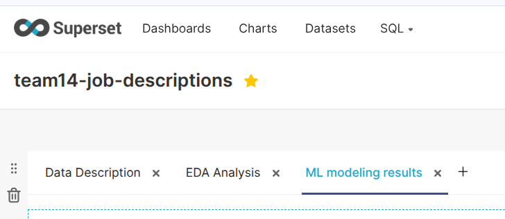

### 8.2. Description of Each Section and Chart

#### 8.2.1. Data Description Section

This initial section sets the context for the analyses presented later. It includes:
*   **Introduction:** Briefly explains the project goals and the dataset's relevance.
*   **Data Source & Repository Links:** Provides links to the original Kaggle dataset and the project's GitHub repository.
*   **Number of Records:** Displays the total count of job postings used (1.62 Million).
*   **Data Types Description:** A table listing the columns and their corresponding data types as defined in the database/Hive.
*   **Data Sample:** Shows a few rows of the raw data to give a feel for the content.

*(Screenshot of the Data Description section)*
*   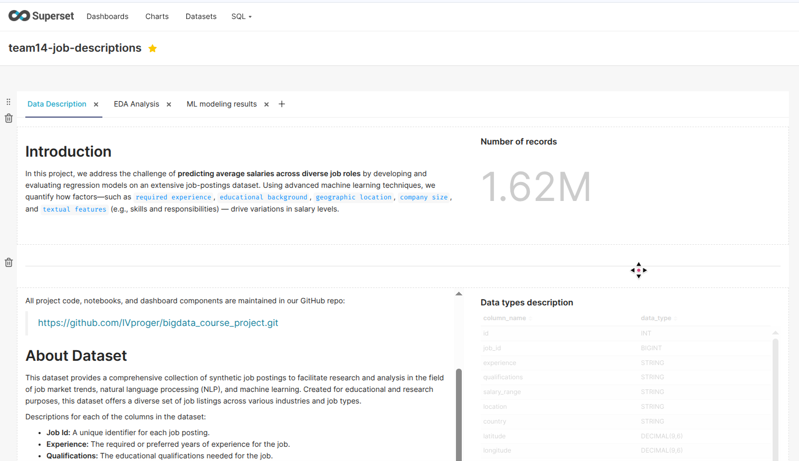

#### 8.2.2. Exploratory Data Analysis (EDA) Section

This section is divided into general analysis and specific insights.

**General EDA Charts (from `scripts/general_feature_analysis.py` results):**
This part explores the overall characteristics and distributions of key features.
*   **Target Statistics (`target-statistics`):** Shows descriptive statistics (count, mean, stddev, min, max) for the target variable `salary_avg`. *Insight: Provides a baseline understanding of the salary distribution (£82.5k ± £7.5k).* 
*   **Correlation with Target (`correlation-with-target`):** Displays the Pearson correlation coefficient between numerical/binary/cyclical features and the `salary_avg`. *Insight: Highlights the weak linear relationship (|corr| < 0.002) between most individual features and the target salary.* 
*   **Features Correlation (Heatmap) (`features-correlation`):** Visualizes the correlation matrix between numerical features to identify multicollinearity. *Insight: Shows high correlation (0.802) between `experience_max` and `experience_avg`, suggesting redundancy.* 
*   **Categorical Counts Charts:** Several bar charts showing the frequency distribution for key categorical variables:
    *   `work-type-counts`: Distribution of jobs across Full-Time, Part-Time, Contract, etc. 
    *   `qualification-counts`: Popularity of different educational qualifications. 
    *   `preference-counts`: Distribution of gender preferences specified (Male, Female, Both). 
    *   `sector-counts`: Job distribution across different industry sectors. 
    *   `industry-counts`: More granular job distribution across industries. 
    *   `gender-distribution` (CEO): Inferred gender distribution for CEOs listed in company profiles. *Insight: 'unknown' dominates (75%), limiting this feature's utility.* 
    *   `company-state-counts`: Geographic distribution of companies by US state (from profile). 
    *   `job-portal-counts`: Distribution of job postings across different source portals. 
*   **Job Portals Counts with Avg Salary:** Compares job portals by the number of postings and the average salary of jobs listed on them. *(Chart image reference missing, assumed based on script capability)*

*   **General EDA Conclusion:** The general analysis revealed a large dataset with diverse categories but weak linear signals for salary prediction and some potential data quality issues (missing benefit flags, dominant 'unknown' CEO gender). This underscored the need for robust feature engineering and potentially non-linear models.

**Specific Insights Charts (from `sql/q*.hql` results):**
This part visualizes the answers to specific analytical questions.
*   **[q1] Avg Salary by Country:** A choropleth map showing the calculated average salary per country. *Interpretation: Provides a visual benchmark for regional compensation, though potentially influenced by synthetic data patterns.* 
*   **[q2] Top 10 Job Roles by Gender Preference:** Bar charts showing the most frequent roles for 'Female', 'Male', and comparing them. *Interpretation: Shows role distribution across specified preferences, useful for D&I analysis, but may reflect synthetic data bias.*   
*   **[q3] Monthly Job Posting Trend:** A line chart displaying the total number of job postings per month over time. *Interpretation: Helps identify potential hiring cycles or overall market growth/decline, though consistency suggests synthetic origin.* 
*   **[q4] Job Categories by Count & Avg Salary:** A bar chart showing the count of jobs and average salary for categories derived from job titles. *Interpretation: Identifies dominant job categories and their relative compensation levels.* 
*   **[q5] Top 10 Job Titles by Qualification:** A table or chart linking the most frequent job titles to their most commonly listed required qualification. *Interpretation: Highlights in-demand roles and the typical educational pathways.* 
*   **[q6] Bi-Annual Trend for Top 5 Roles:** Line or bar charts showing the count and percentage of postings for the top 5 roles during the first (H1) and second (H2) halves of each year. *Interpretation: Examines potential seasonality in demand for specific high-volume roles.* 

#### 8.2.3. ML Modeling Results Section

This section presents the outcomes of the predictive modeling stage.

*   **ML Modeling Introduction:** Briefly describes the goal (predicting `salary_avg`) and the models used (Linear Regression, GBT Regressor).
*   **Hyperparameter Tuning Tables:** Displays the results of the 3-fold cross-validation tuning process, showing the parameter combinations tested and their corresponding average RMSE for both Linear Regression and GBT. *(Assumes tables are present based on Stage 3 outputs `lr_tuning_results.csv` and `gbt_tuning_results.csv`)*.
*   **Model Performance Evaluation:** Presents the key evaluation metrics calculated on the held-out test set:
    *   **RMSE & R2 Table:** Shows the Root Mean Squared Error and R-squared values for both models on the (log-transformed) test data. *Interpretation: Highlights low R2 values, indicating poor predictive power.* 
    *   **KL Divergence Table:** Shows the Kullback-Leibler Divergence comparing the distribution of original-scale predictions vs actuals. *Interpretation: Shows GBT's predicted distribution was closer to the actual distribution.* 
*   **Prediction Previews:** Tables or scatter plots showing examples of actual vs. predicted salaries (original scale) for both models.
    *   
    *   
*   **ML Modeling Summary:** Concludes that while models were trained successfully, their predictive accuracy was limited by the available features, with GBT showing a slight edge in distributional fit.

### 8.3. Findings from Presentation Layer

Presenting the results in Apache Superset offered several advantages:
*   **Interactivity:** Allowed users to filter, drill down, and explore the data dynamically, going beyond static reports.
*   **Consolidation:** Brought together insights from different stages (EDA, ML) and data sources (PostgreSQL, Hive/HDFS) into a single interface.
*   **Accessibility:** Provided a web-based platform for stakeholders to easily view and interact with the project outcomes without needing direct access to the underlying databases or code.
*   **Visual Storytelling:** Enabled the creation of a narrative flow through the arrangement of charts and text elements, guiding the user through the data description, analysis, and modeling results.

The key findings reinforced through the dashboard were:
*   The dataset's breadth and the initial identification of weak linear predictors during EDA.
*   The limited success of the ML models in accurately predicting salaries point-wise (low R2), despite systematic tuning.
*   The GBT model's slightly better performance in capturing the overall salary distribution compared to Linear Regression (lower KL divergence).
*   The clear visualization of specific EDA insights, such as salary variations by country or role popularity trends.

---

## 9. Conclusion

### 9.1. Summary of the Report

This report has detailed implementation of an end-to-end big data pipeline designed to process, analyze, and model a large synthetic job description dataset from Kaggle. The project successfully integrated various technologies across four automated stages: **(1) Data Collection & Storage**, where data was ingested from Kaggle, staged in PostgreSQL, and transferred to HDFS in Avro/Snappy format using Sqoop; **(2) Hive Data Warehousing & EDA**, involving the creation of optimized (partitioned/bucketed) Hive tables and performing both general feature analysis and specific insight queries using Spark SQL, with results stored in PostgreSQL; **(3) Predictive Data Analytics**, which focused on extensive feature preprocessing (including text, categorical, numerical, date, and geospatial features), log-transforming the salary target, and training/tuning Linear Regression and GBT models using Spark ML CrossValidator; and **(4) Presentation Preparation**, where model performance was evaluated (RMSE, R2, KL Divergence), predictions were generated, and Hive external tables were created to expose results for visualization.

The architecture effectively utilized PostgreSQL for staging and EDA results, HDFS for primary data lake storage, Hive for data warehousing, Spark for distributed processing/analysis/ML, and Superset for presentation. Automation was achieved through orchestrated Bash and Python scripts. Key findings include insights from EDA on job market characteristics (though potentially influenced by synthetic data patterns) and the limited predictive power (low R2) of the ML models for salary prediction despite tuning, although the GBT model showed a slightly better distributional fit (lower KL divergence). The project provides a robust framework and valuable artifacts, culminating in data ready for interactive exploration via the Superset dashboard.

### 9.2. Reflections on Own Work

Reflecting on the project, the team successfully navigated the complexities of building a complete big data pipeline. Key positive takeaways and learning experiences include:

*   **Learning Outcomes:** Significant hands-on experience was gained across the Hadoop ecosystem, including HDFS operations, data ingestion with Sqoop, Hive table design (partitioning/bucketing) and HQL, and extensive use of Apache Spark (SQL for EDA, PySpark DataFrames for processing, and MLlib for building, tuning, and evaluating models). Constructing and debugging the multi-stage Spark ML preprocessing pipeline was a major learning curve. Integrating diverse tools (PostgreSQL, Hive, Spark) and automating the workflow with Bash scripts provided valuable practical knowledge.
*   **Successes:** The successful automation of the four distinct stages, processing a large dataset (1.6M records) from ingestion to ML evaluation, stands out as a key achievement. Implementing sophisticated preprocessing steps like ECEF coordinate transformation and cyclical date features demonstrated technical depth. The integration of results into Hive external tables for Superset connectivity was also successful.
*   **Team Collaboration:** The project necessitated effective collaboration, likely involving dividing tasks based on stages or technologies (e.g., database setup, Hive optimization, Spark ML development, automation scripting). Utilizing version control (Git) was crucial for managing the codebase across different components and stages.
*   **Process Improvement:** The staged approach allowed for modular development and testing. Early identification of data characteristics through general feature analysis (even if showing weak signals) helped inform later stages. The comprehensive scripting (`stage*.sh`) ensured reproducibility.
*   **Overall Experience:** The project provided a realistic and engaging challenge, offering practical insights into the lifecycle of a big data project, from raw data handling to delivering analytical results and model outputs.

### 9.3. Challenges and Difficulties

Several challenges were encountered during the project implementation:

*   **Environment Setup & Integration:** Initial setup and ensuring seamless communication between PostgreSQL, Sqoop, HDFS, Hive Metastore, YARN, and Spark, along with managing Python dependencies and JDBC drivers across the cluster nodes, likely required significant configuration effort.
*   **Debugging Distributed Jobs:** Troubleshooting errors in distributed Spark jobs (especially complex ML pipelines) and Sqoop imports can be challenging due to dispersed logs and the nature of distributed execution. Understanding resource allocation (memory, cores) in YARN was also key.
*   **Data Cleaning and Parsing:** Handling inconsistencies within the synthetic dataset required robust parsing logic (e.g., `salary_range`, `experience`, nested JSON in `company_profile`). Cleaning the `benefits` string effectively for feature extraction also posed difficulties.
*   **Feature Engineering:** While various techniques were applied (TF-IDF, OneHotEncoding, ECEF, cyclical dates), developing features that strongly correlated with the target salary proved difficult, likely limited by the synthetic nature of the data and the inherent complexity of salary prediction.
*   **ML Model Performance:** Achieving high predictive accuracy (as measured by R2) was a significant challenge. The near-zero R2 values indicate that the models struggled to explain salary variance, necessitating careful interpretation and highlighting the limitations of the current feature set.
*   **Interpreting Metrics:** Relating metrics calculated on the log-transformed scale (RMSE, R2) back to the original salary scale and understanding the complementary information provided by KL divergence required careful consideration.
*   **Manual Presentation Layer:** Creating the Superset dashboard manually, while effective for visualization, represents a break in the end-to-end automation pipeline.

### 9.4. Recommendations

Based on the project outcomes and challenges, several recommendations for future work or improvements emerge:

*   **Enhance Feature Engineering:**
    *   **Advanced NLP:** Move beyond TF-IDF for `job_description`, `skills`, `responsibilities`. Explore techniques like pre-trained word embeddings (Word2Vec, GloVe) or transformer-based models (BERT) to capture semantic meaning more effectively. Use libraries like SpaCy or NLTK for Named Entity Recognition (e.g., extracting specific technologies, tools, certifications).
    *   **Interaction Terms:** Systematically create interaction features, particularly between categorical features (e.g., `role` & `country`, `qualifications` & `sector`) and between numerical and categorical (e.g., `experience_avg` & `role`).
    *   **Salary Range Handling:** Instead of averaging, consider predicting the min and max salary separately or treating it as a range prediction problem if models support it.
    *   **Categorical Encoding:** For high-cardinality features (`job_title`, `industry`), investigate target encoding (with cross-validation to prevent leakage) or feature hashing as alternatives to OneHotEncoding.
*   **Explore Different ML Models:**
    *   Implement Random Forest Regressor, which often performs well with default settings and can provide feature importance insights.
    *   Consider XGBoost or LightGBM (potentially via Spark bindings like SynapseML or by exporting data), as they often outperform standard GBTs.
*   **Address Data Quality & Input:**
    *   If possible, acquire a real-world job posting dataset to compare performance and validate insights, as synthetic data may lack realistic complexities and correlations.
    *   Implement more sophisticated imputation for missing values (e.g., KNNImputer, model-based imputation) rather than simple filling or dropping.

---

## 10. The Table of Contributions of Each Team Member

*(Please fill this table with accurate contributions for each member of Team 14):*

| Team Member Name | Contributions                                                                 |
| :--------------- | :---------------------------------------------------------------------------- |
| Maxim Martyshov  | (e.g., Stage 1 implementation, PostgreSQL setup, Sqoop configuration)         |
| Ivan Golov       | (e.g., Stage 2 implementation, Hive optimization, Spark SQL EDA queries)      |
| Elisey Smirnov   | (e.g., Stage 3 implementation, Spark ML preprocessing, Model training/tuning) |
| Roman Makeev     | (e.g., Stage 4 implementation, KL divergence script, Superset integration prep) |
| All       | (e.g., Automation scripts (`stage*.sh`, `main.sh`), Documentation (`report*.md`, `README.md`), General Feature Analysis, Testing, Superset Dashboard Creation) |

---
